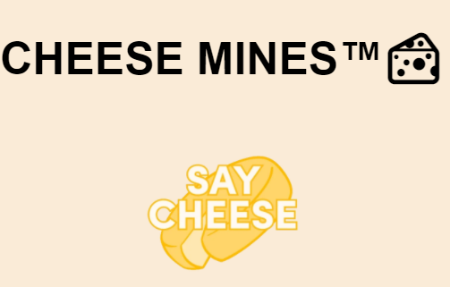
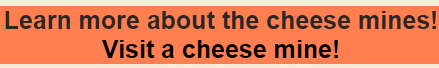
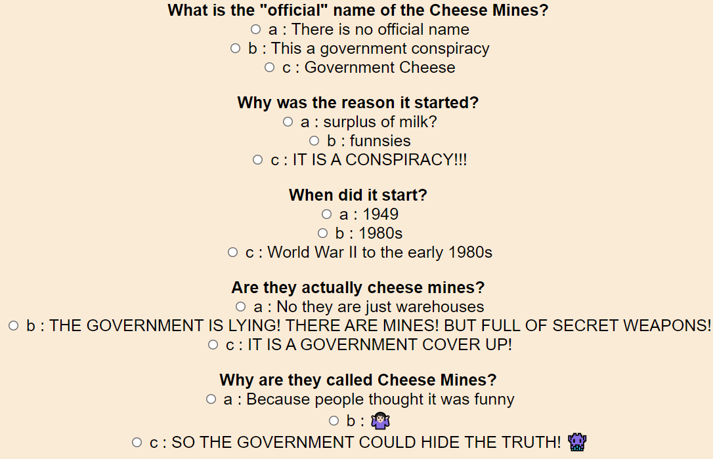
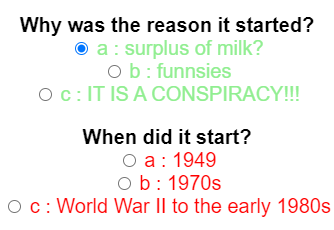
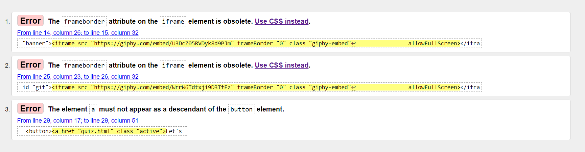
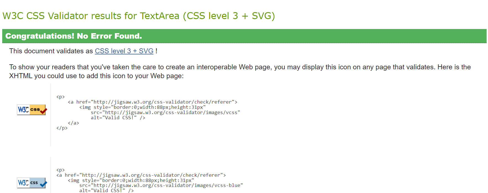

# Cheese Mines Quiz™🧀

## Description

A fun online quiz meant to educate people about the cheese mines in the USA! How did they start? Why? Is it all a conspiracy? 👀

This website tries to have the old 90s conspiracy website vibe/design. To poke fun of the people that make everything a conspiracy, especially if it involves the government.
 

## Existing Features

#### Logo & Banner
- Featured at the top of the page, the logo and banner, which is a gif, are easy to see for the user.

#### Navigation Bar

- It features
  - Two links:
    - In the Homepage, there are two links, one takes the user to a history channel article about the "cheese mines", if the user wishes to learn more.
    - In the quiz page thr user has a third link in the nav bar, a link to get to the homepage.
  

#### Quiz

- Seven questions.
  - Three answers.
    - A submit button at the end of the quiz.
      - It will highlight if you got the correct or wrong answer, if it is correct it will highlight in green, if it is wrong it will highlight in red.
      - It will also show how many questions, out of four, the user got right.

 

## Planning

- First I've had to figure put who is this website for?
  - Is the topic interesting?
    - Why this topic? 
      - Cheese mines sounds more like an amusment park ride than goverment warehouses full of cheese.
      - People in the USA somewhat now what they are (or think that they are fake) but not here in here in Europe. So I thought their fun and turn into a fun quiz.
     

I've drawn a small outline on how the website should like first, before start coding.

 

## Bugs & Fixes

- The JavaScript Quiz would not show on HTML page.
Managed to fix by retyping last part of the code in JS and fixing file arrangement.
- If the user selects the correct answer, it will still mark it as wrong.
Fixed, the bug was caused by a typo in JS.

## Unfixed Bugs

When the user get an answer right or wrong, the entire section get's highlighted not just the answer.

 

## Testing

#### Validator

- HTML
  - A couple of erros were found in index.html

- CSS
  - No errors were returned when passing through the official W3C validator

- JS
- - No errors were found when passing through the official (Jigsaw) validator
  - Metrics returned:
    - There are 5 functions in this file.
    - Function with the largest signature take 2 arguments, while the median is 0.
    - Largest function has 8 statements in it, while the median is 4.
    - The most complex function has a cyclomatic complexity value of 3 while the median is 1.

#### Browers tested on
- Opera GX
  - Worked normally 
- Microsoft Edge
  -  Worked normally
- Google Chrome
  - Worked normally
  
 

## Credit

#### Code inspired by

- The tutorial of Web Dev Simplified <https://www.youtube.com/watch?v=riDzcEQbX6k>
- And from SimpleStepCode <https://simplestepscode.com/javascript-quiz-tutorial/>

#### Gifs
- The gifs used have been taken by Giphy https://giphy.com/

#### Languages used

- HTML
- CSS
- JavaScript

#### Note taking & Planning

- Obsidian Notes
  - It is an interesting productivity application. It is a Markdown-based system that incorporates tags, plugins and back-links to create a compelling to use system. Great tool for note-taking and planning out projects. Later you can export your notes as PDFs. 

